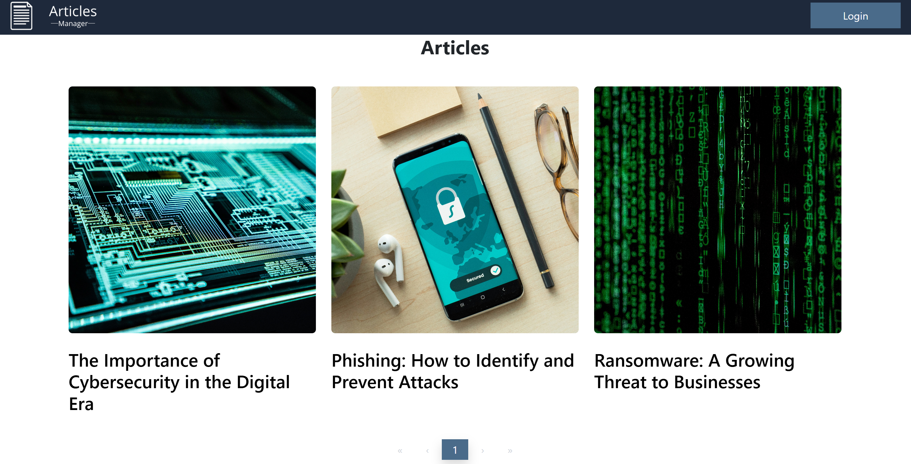
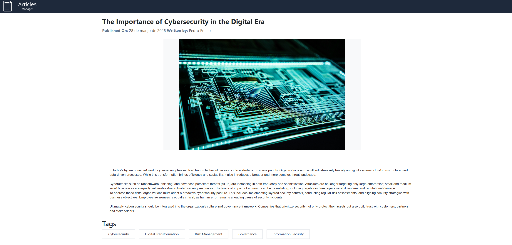
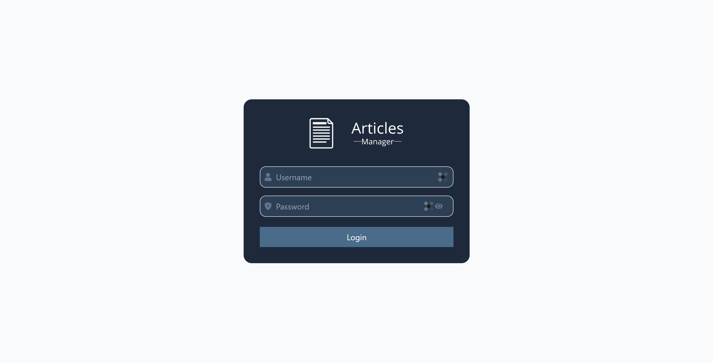
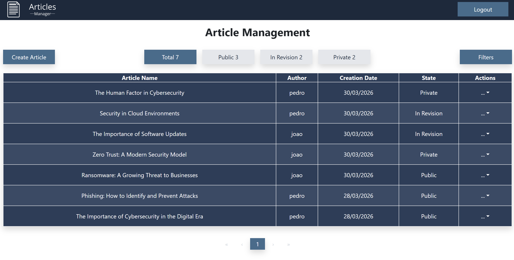
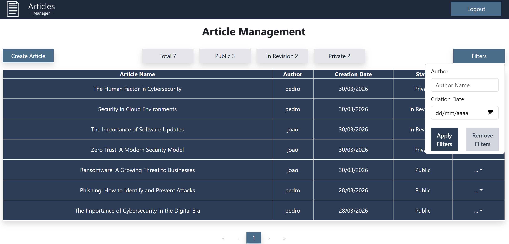
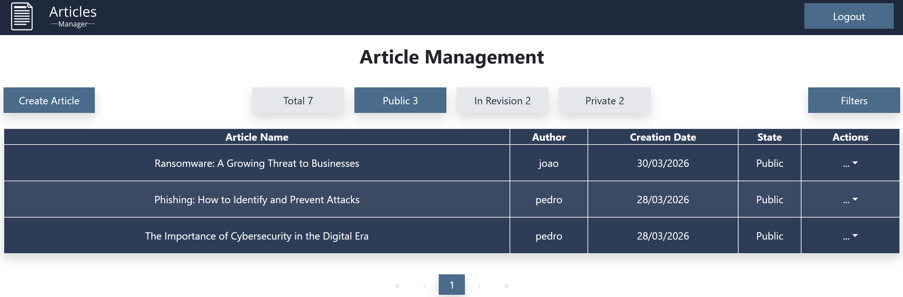
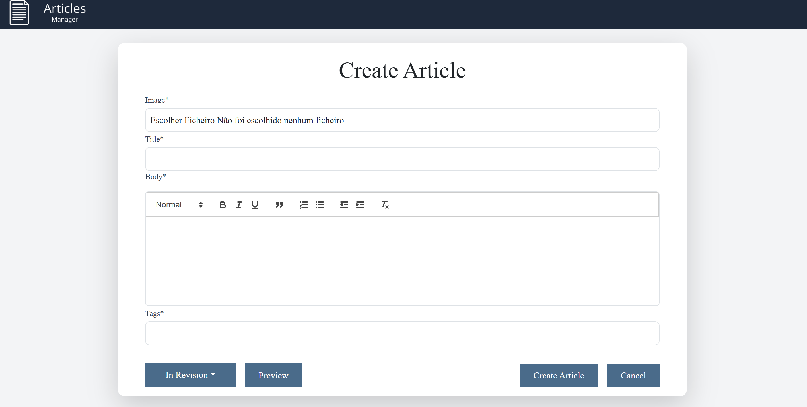
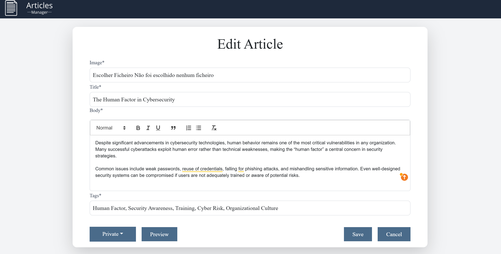

# ArticlesManager

## Overview
ArticlesManager is an internal article management system designed for companies. It allows teams to create, edit, remove and view articles, with a public-facing frontend and a full REST API for backend management.

Unauthenticated users can browse public articles. Authenticated users have access to the full article dashboard where they can manage all articles regardless of status. User management (list, create, edit, delete) is implemented on the backend and available via the REST API.

The application uses Django's CSRF protection on all state-changing requests, with session-based authentication on the frontend and token-based authentication on the backend.

## Tech Stack

**Backend**
- Python / Django
- Django REST Framework
- Knox — token-based authentication
- django-axes — brute force protection
- PostgreSQL
- CSRF protection — Django's built-in CSRF middleware

**Frontend**
- React
- Tailwind CSS
- Bootstrap
- React Quill
- Axios — HTTP client

## Features

### Articles
- [x] List all articles (authenticated users see all, guests see public only)
- [x] View individual article by slug
- [x] Create article
- [x] Edit article
- [x] Delete article

### Users
- [x] List users (backend only)
- [x] View user detail (backend only)
- [x] Create user (backend only)
- [x] Edit user (backend only)
- [x] Delete user (backend only)

### Authentication
- [x] Session-based login (frontend)
- [x] Token-based login (backend / Postman)
- [x] Logout
- [x] Auto-logout after 30 minutes of inactivity

### Not yet implemented
- [ ] User management frontend

## Screenshots

<p align="center">
  
  <br/>
  <em>Public article listing</em>
</p>

<p align="center">
  
  <br/>
  <em>Article Detail View</em>
</p>

<p align="center">
  
  <br/>
  <em>Login Page</em>
</p>

<p align="center">
  
  <br/>
  <em>Article Management Dashboard</em>
</p>

<p align="center">
  
  <br/>
  <em>Article Management Dashboard Using Basic Filter</em>
</p>

<p align="center">
  
  <br/>
  <em>Article Management Dashboard Using Visibility Filter</em>
</p>

<p align="center">
  
  <br/>
  <em>Create Article</em>
</p>

<p align="center">
  
  <br/>
  <em>Edit article</em>
</p>

## Getting Started

### Prerequisites
- Python 3.12+
- Docker
- Git

### Installation

1. **Clone the repository**
```bash
git clone https://github.com/pedroemilio-dev/ArticlesManager.git
cd ArticlesManager
```

2. **Create and activate a virtual environment**
```bash
python -m venv env

# Linux/Mac
source env/bin/activate

# Windows
env\Scripts\activate
```

3. **Install dependencies**
```bash
pip install -r requirements.txt
```

4. **Run migrations**
```bash
python3 manage.py makemigrations
python3 manage.py migrate
```

5. **Load the database fixtures**
```bash
python3 manage.py loaddata fixtures/db.json
```

6. **Run the development server**
```bash
python3 manage.py runserver
```

7. **Access the application**

Open your browser and go to `http://localhost:8000`

### Testing the API (Postman)
The backend API is available at `http://localhost:8000`

To test the endpoints:
1. Make a `GET` request to `http://localhost:8000/api/csrf/` to obtain the CSRF token
2. In the **Scripts → Post-response** tab, add:
```javascript
pm.environment.set("csrfToken", pm.cookies.get("csrftoken"));
```
3. Use `{{csrfToken}}` in the `X-CSRFToken` header for all subsequent requests

### Default credentials
| Username | Password | Role |
|----------|----------|------|
| pedro | 123 | Admin |
| joao  | Password123! | Staff |

## Production

Before deploying to production, make sure to:

1. **SECRET_KEY** — Replace the hardcoded key with a secure randomly generated key stored in an environment variable:
```
SECRET_KEY=your-secure-random-key
```

2. **DEBUG** — Set to `False`:
```
DEBUG=False
```

3. **ALLOWED_HOSTS** — Restrict to your domain:
```
ALLOWED_HOSTS=yourdomain.com
```

4. **HTTPS** — Set the following to `True` to enforce HTTPS:
```python
SESSION_COOKIE_SECURE = True
CSRF_COOKIE_SECURE = True
```

5. **CORS & CSRF** — Update `CORS_ALLOWED_ORIGINS` and `CSRF_TRUSTED_ORIGINS` to your production domain.

6. **Database** — Store all credentials securely in environment variables and never commit them to version control.
